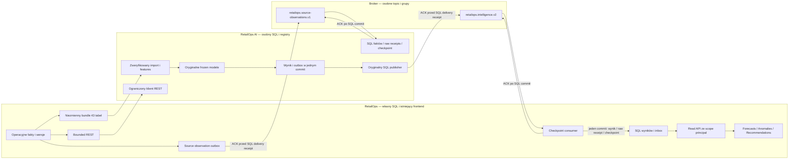

# AI 10 — odbiór integracji RetailOps

Aktualizacja: 2026-10-07. **Status: in_progress.** Bieżące PR-y:
[AI #28](https://github.com/Oskar-Stachowski/retailops-ai-intelligence/pull/28)
i [Source #100](https://github.com/Oskar-Stachowski/retailops-cloud-native-platform/pull/100).
Status `ready` wymaga wszystkich dowodów niżej oraz chronionego merge i zielonego
Required CI obu `origin/main`. Szczegóły starszych przyrostów zachowuje
[historia](ai10-progress.md); wcześniejsze receipts nie są przepisywane.
Pełne Required CI komponentów Source `cbbf711` zaliczyło wszystkie 30 jobów:
[receipt](evidence/ai10-source-components-ci.json). Końcowe heady dokumentacji
i oba opublikowane main wymagają własnego potwierdzenia.
[Raport bounded odbioru](evidence/ai10-bounded-acceptance.json) wiąże SHA
wszystkich receipts, sumy przed/po korekcie, offsety i jawne pending gates.

## Zakres i stan dowodów

| Granica | Rzeczywisty odbiór | Stan |
| --- | --- | --- |
| Immutable snapshot | Kompletny SourceSnapshot, typed Parquet, SHA, immutable import i HTTP bundle z osobnym service grantem | Odebrany komponent; [receipt](ai10-source-bundle-ci-receipt.json) |
| Bounded REST | Rzeczywisty Source OpenAPI, jawne legacy ziarno i capabilities, 50/100 pagination, deadline/retry i auth | Odebrany komponent; [receipt](ai10-rest-ci-receipt.json); pełne sales grain zwraca unsupported |
| Snapshot REST/SQL 43 tabel | Brak ogólnej historii i wspólnego wektora dla wszystkich tabel | Jawnie unsupported; bounded live reads nie reklamują snapshotu |
| Stream obserwacji | Source SQL outbox i capture pełnego TLS/SCRAM prefixu; osobny AI SQL, checkpoint, ACK, overlap i późna korekta | **Passed**: [oryginalny receipt](evidence/ai10-source-sql-handoff-accepted.json), 9 testów, sumy 4 → 7, ACK `[0,0,3]` → `[0,0,4]` |
| Qualified stockout | Frozen model, registry/cold worker, oryginalny publisher AI SQL i 40 ACK, Source SQL/API i built UI | **Passed**: [oryginalny SQL receipt](evidence/ai10-native-stockout-original-sql-accepted.json), 40 wyników/40 duplikatów, ACK `[34,46]` |
| Qualified anomaly | Oryginalny model AI07, OCI/registry/SIGKILL recovery, 1232 wyników, Source SQL/API i 25 stron built UI | **Passed** dla file handoff: [receipt](evidence/ai10-native-anomaly-accepted.json); oryginalny SQL publisher wymaga nowego pełnego odbioru |
| Oryginalny forecast v12 | 664 oryginalne pliki i frozen wheel, nowy Source 102 dni/43 tabele, 56 wyników/4 szeregi/horyzont 14, MLflow/SQL/publisher/Source API/UI | Archiwum [passed](evidence/ai10-original-v12-recovered.json); pełny native runtime pending |
| Awarie i trwałość | Brak ACK przed SQL commit, SIGKILL po commit, fencing, gaps, raw quarantine, niedostępne SQL/broker/DLQ i recovery | Odebrane obowiązkowe komponenty; [SQL](ai10-durable-observation-replay-ci-receipt.json), [TLS broker](ai10-observation-broker-ci-receipt.json), [checkpoints](ai10-checkpoint-ci-receipt.json) |
| Sugestie | Jawny poprawny fixture, human approval, auth, trwałe read API i istniejący UI | Odebrany zakres AI10; rzeczywisty producent należy do AI12: [receipt](ai10-suggestion-ui-ci-receipt.json) |
| Publikacja | Oba dokładne HEAD, Required CI, protected merge, Required CI obu main | Pending |

Każdy receipt podaje własny dokładny commit i run ID. Ich zestaw jest odbiorem
integracji; nie jest nowym wspólnym eksperymentem jakości trzech modeli.
Modele zachowują swoje zaakceptowane Source snapshots, originy i kwalifikacje.
Stream obsługuje jawnie `daily_demand_versions`; jego fixture sprawdza protokół
sum/korekt, nie kwalifikuje ML. Pełny immutable bundle pozostaje osobną ścieżką
43 tabel. Nie wolno dopisywać do niego fikcyjnych granic brokera.
Kompletne native ziarno sprzedaży, wersje i availability dostarcza wersjonowany
immutable bundle. Bounded REST zachowuje swoje rzeczywiste ograniczenia;
`require_full_sales_grain()` zwraca `unsupported_grain`.

## Własność danych i granice zapisu



Repozytorium Source jest właścicielem faktów operacyjnych, eksportów,
read models i interfejsu. AI jest właścicielem importów, kwalifikacji,
registry, obliczeń i własnego outbox. Workery używają oddzielnych baz i grantów;
API nie zapisuje modelowych wyników. Broker przenosi eventy i pozycje transportu,
a SQL rozstrzyga trwałość i deduplikację. Ścieżka obserwacji zachowuje osobny
bounded zakres `daily_demand_versions`; nie stanowi dowodu kwalifikacji ML
ani streamu wszystkich 43 tabel. HTTP/broker credentials pozostają poza Git.

## Odtworzenie krok po kroku

1. Przypnij oba commity i schema/registry SHA. Używaj własnych baz, grup brokera,
   service/personal credentials poza Git oraz osobnych sieci baz danych.
   Migracje AI i Source wykonuj jawnie; API nie migruje przy starcie.
2. W trybie snapshot pobierz pełny niezmienny manifest i każdy zadeklarowany plik;
   zweryfikuj wszystkie bytes/schema/rows przez importer. Buduj curated i features
   wyłącznie z tego zweryfikowanego źródła. Bundle nie deklaruje replay handoff.
3. W trybie REST użyj [typowanego klienta](source-rest-v2.md): 50 rekordów domyślnie,
   najwyżej 100, faktyczne filtry OpenAPI, ograniczony deadline/retry GET i scope.
   Świeżość ocenia się według biznesowej dostępności; czas HTTP nie odświeża faktu.
   Brak spójnego snapshotu/history zwraca jawny unsupported.
4. Dla streamu wykonaj Source append/publish i [capture](source-observation-replay.md).
   Odbiorca sprawdza authority, cluster/topic IDs, wszystkie partycje, pełny prefix
   i wersje historii. SQL facts/raw receipt/checkpoint/quarantine mają jeden commit;
   dopiero potem wolno ACKować faktycznie odczytany offset. Korekta zastępuje wkład,
   a overlap nie dodaje drugiej ilości. Utrata retencji wymaga resync.
5. Uruchom dedykowany `AI10 Source capture handoff`. Przypięty Source zachowuje
   własny broker podczas niezależnego odbioru SQL AI. Wymagaj równości capture
   Source = prefix AI SQL oraz capture + overlap = full SQL replay. Artefakt
   `independent-ai-sql-handoff.json` zawiera rzeczywiste ACK i sumy 4 → 7.
6. Dla stockout/anomaly uruchom `AI10 qualified native output`. Zachowaj oryginalne
   kwalifikacje i frozen modele; nie ponawiaj ocen końcowych ani refitów. Source,
   jego oddzielny SQL/broker, built UI i Chromium muszą być przygotowane przed
   wykonaniem acceptora. Baza AI pozostaje aktywna do końca odbioru Source.
7. Istniejący publisher musi dostarczyć pełny census z oryginalnego AI SQL,
   uzyskać ACK, następnie utrwalić partition/offset. Source porównuje original
   native IDs/payloads, SHA wartości na tych ACK coordinates oraz pełny SQL
   transport fingerprint, z kluczem, headers i timestamp. Jednorazowy replay
   daje dokładnie N wyników i N duplikatów. [Instrukcja modeli](intelligence-models-v2.md).
8. Dla v12 użyj `AI10 original v12 native output` i [instrukcji recovery](ai10-v12-original-recovery.md).
   Pełny oryginalny verifier i wszystkie dziesięć review gates są obowiązkowe.
   Nowe wejście inference ma 102 dni historii, 14 dni planów, 43 tabele i brak truth.
   Oryginalny wheel/recipe i lock pozostają niezmienione. Kwalifikacja wejścia
   obejmuje dwa cold predictions, rzeczywisty registry/SQL i atomowy outbox.
9. V12 zachowuje oryginalną ocenę `not_ready` i dokładną decyzję właściciela
   `11cd0e1fdd10629543bcb66aaedb3bd9b7b7fc5b31473575b998d951c93f00d2`.
   Działa wyłącznie w `retailops-demand-forecast-v12-development`. Standardowy
   model nie dziedziczy tej decyzji. Source owner review wymaga dokładnego
   acceptance SHA, a istniejący Forecasts UI wyświetla zakres development.
10. W istniejących panelach RetailOps odczytaj każdy oryginalny native ID,
    pełny payload, ziarno, jednostkę, source/model/run/dataset lineage i freshness.
    Użyj osobistego grantu trzymanego wyłącznie w pamięci przeglądarki.
    Brak credential → 401; obcy scope → 403/404; `user_id` nie rozszerza praw.
    Built UI musi potwierdzić wszystkie strony oraz live revocation/wyczyszczenie.
11. Weryfikuj awarie przez obowiązkowe real SQL/broker/SIGKILL jobs, nie tylko
    fixtures kontraktów. Zachowaj raw poison przed ACK; niedostępna kwarantanna
    zatrzymuje partycję. Nie omijaj luki ani nie commituj nieodczytanego suffixu.
    Po naprawie wznów tę samą grupę; zachowane SQL receipts deduplikują retry.
12. Pobierz publiczne artefakty i sprawdź ZIP size/SHA, dokładne HEAD/run IDs,
    counts oraz zakresy. Zachowaj receipts bez credentials, signed URLs i 32 GB
    archiwum. Cleanup usuwa tylko zasoby z własnym UUID/label i własne pomocnicze
    handoff objects/secret; oryginalne S3 i inne sesje pozostają zachowane.
13. Zaktualizuj status, README, registry etapów i checklist po zaliczeniu pełnego
    odbioru. Zaliczone Required CI dokładnych HEAD umożliwia normalny protected
    merge obu PR-ów; potem zweryfikuj obu `origin/main` oraz ich Required CI.
    Starsze draft PR-y zamykaj dopiero po sprawdzeniu zachowania wszystkich zmian.

Lokalnie Docker pozostaje wyłączony; długie i kontenerowe odbiory wykonują
jednorazowe runnery GitHub. Rezerwa lokalnego dysku pozostaje co najmniej 50 GiB.

## Lokalne komendy i ich granice

```sh
make integration-replay-test
make integration-failure-test
make observation-persistence-test
make observation-broker-test
```

`integration-replay-test` sprawdza kontrakty i mechanikę; nie kwalifikuje modeli.
Pozostałe trzy komendy wymagają własnego runtime Docker, więc w tej sesji wykonuje
je obowiązkowy CI. Pełne native modele/API/UI i Source capture mają osobne
dedykowane workflowy opisane wyżej. Zaliczenie samej komendy nie zamyka AI10.

## Pozostałe warunki zamknięcia

- [x] Immutable snapshot, bounded REST i jawny unsupported ogólnego snapshot REST.
- [x] Rzeczywisty Source SQL/capture → ten sam TLS broker → AI SQL/ACK/overlap.
- [x] Qualified stockout/anomaly przez rzeczywiste Source API i built UI.
- [x] Stockout przez oryginalny AI SQL publisher przed cleanupem.
- [ ] Anomaly przez oryginalny AI SQL publisher przed cleanupem.
- [ ] Oryginalny v12 przez pełny registry/SQL/publisher/Source API/UI na 102 dniach.
- [ ] Końcowy raport bounded odbioru, aktualne statusy i registry.
- [ ] Required CI obu dokładnych HEAD oraz obu main po protected merge.
